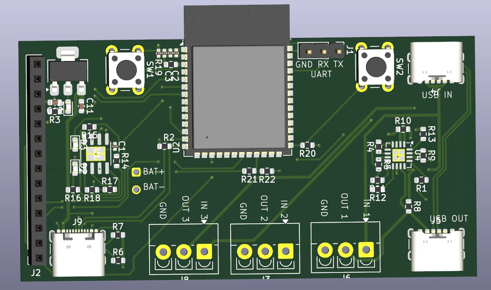
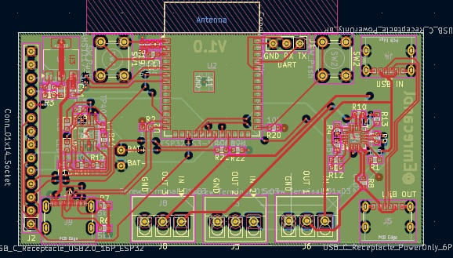
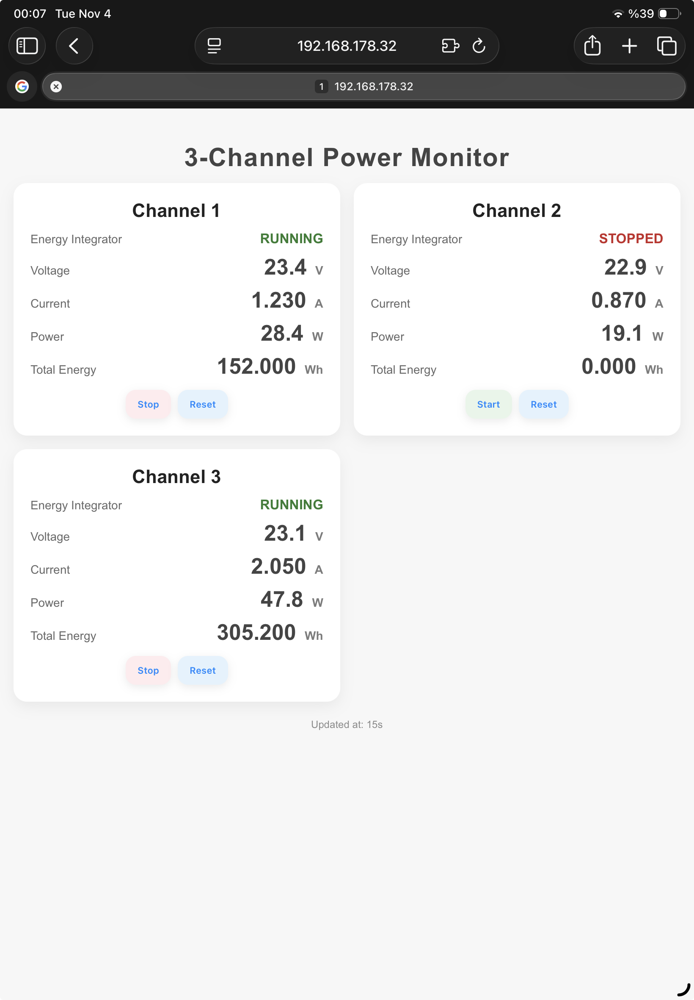
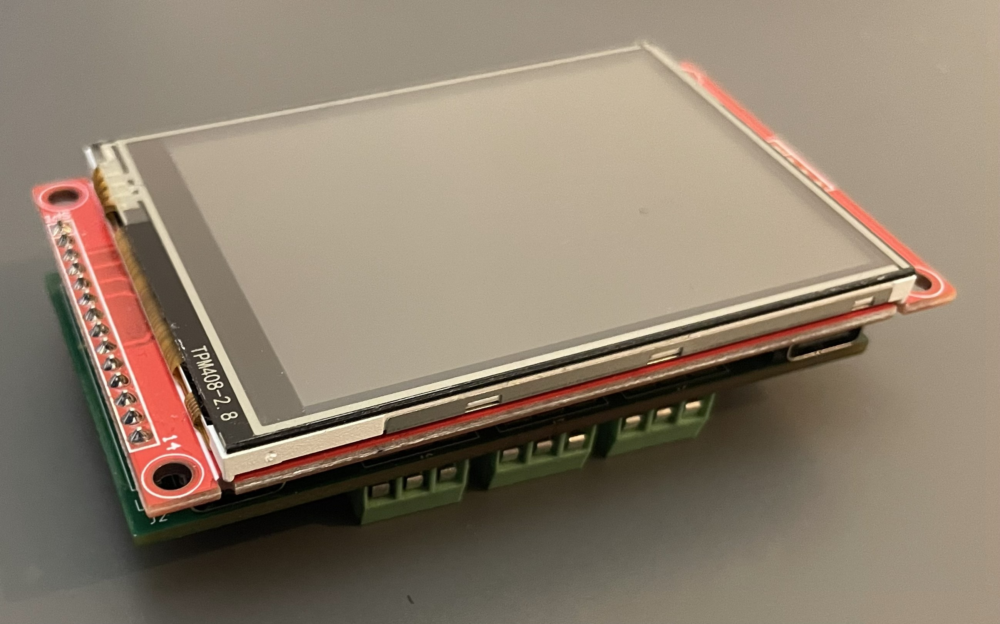
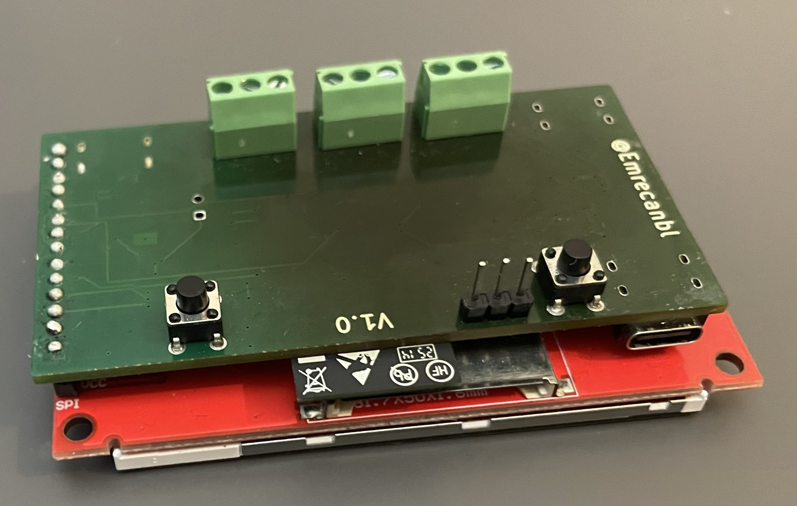
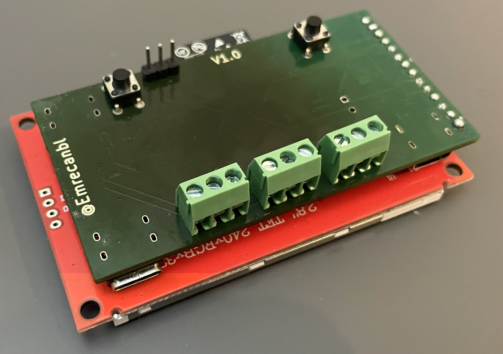
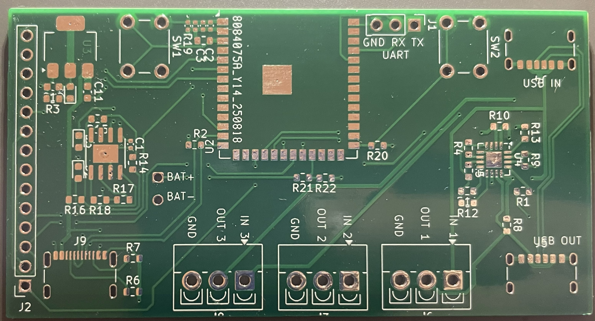
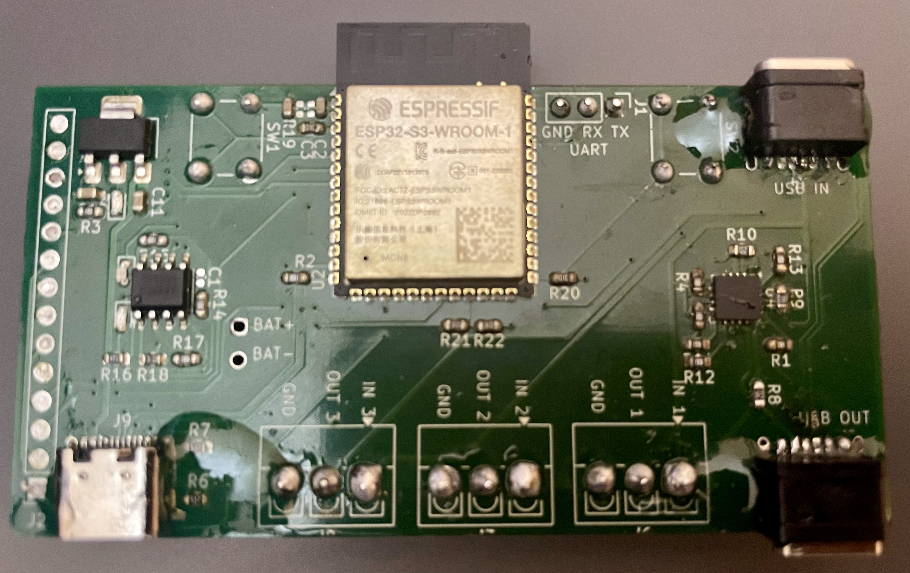
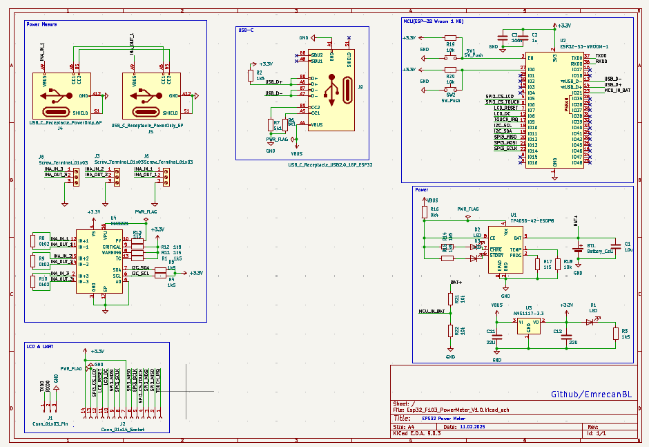

# ESP32-S3 Power Meter (INA3221 · 2.8" LVGL UI)

An ESP32-S3–based **three-channel power meter** built around INA3221. It drives a **2.8" SPI TFT (ILI9341) with resistive touch (XPT2046)** using **LVGL**. One channel supports **USB-C pass-through** so you can measure power flowing from **USB-C IN → USB-C OUT**; **CC pins are tied** for basic PD trigger behavior (power-only path).

> Firmware stack: **FreeRTOS**.  
> REST/WebSocket API is **optional** (may be added later).  
> **No on-device logging** (no SD/flash). Live data appears on-screen and can be streamed over **USB-CDC** if needed.
>
> A custom **3D-printed enclosure** is planned.

---
---

## Features

- **3 measurement channels** via **INA3221**
  - Voltage (V), Current (A), Power (W), accumulated **mAh / mWh**
  - Efficiency Measurement The board can measure real conversion efficiency by comparing input and output power
- **ESP32-S3** (Wi‑Fi + native USB/CDC)
  - UART header and USB device available on the board
- **2.8" ILI9341** SPI TFT + **XPT2046** touch, **LVGL** user interface
- **USB‑C pass‑through (1 channel)**: measure power across IN → OUT
  - **CC lines tied** (basic PD role trigger; data lines not routed)
- **Battery**: **TP4056** Li‑ion charger + **AMS1117‑3.3** LDO
- **Enclosure**: custom **3D‑printed** case (to be published)

---

## Gallery

<p align="center">
  &nbsp;&nbsp;
  <br>
  <em>3D board render &nbsp; | &nbsp; PCB layout</em>
</p>

<p align="center">
  <br>
  <em> </em>
</p>

<p align="center">
  <br>
  <em>Early Web UI (prototype)</em>
</p>

<p align="center">
  <!-- Add your prototype photos below when ready -->
  &nbsp;&nbsp;
  &nbsp;&nbsp;
  <br>
  <em>Prototype (front) &nbsp; | &nbsp; Prototype (back-1) &nbsp; | &nbsp; Prototype (back-2)</em>
</p>

<p align="center">
  <br>
  <em>Producted PCB (first article)</em>
</p>

<p align="center">
  <br>
  <em>Assembled PCB </em>
</p>

<p align="center">
  <br>
  <em>Schematic (block view)</em>
</p>

> **Tip:** Place your photos into the repo under `Photos/` with the following filenames:  
> `PCB.jpg`, `PCB_Model.jpg`, `Prototype.jpg`, `Prototype_Back1.jpg`, `Prototype_Back2.jpg`, `Real_PCB.jpg`, `Schematic.png`.


## Hardware Overview

- **MCU:** ESP32‑S3 module  
- **Power Monitor:** INA3221 (three shunts)  
- **Display/Touch:** 2.8" ILI9341 (320×240) + XPT2046 over SPI  
- **Power Path:** USB‑C IN, USB‑C OUT (pass‑through on Channel 1)  
- **PMICs:** TP4056 Li‑ion charger, AMS1117‑3.3 regulator  
- **Connectors:** 3× screw terminals (IN/OUT/GND), UART header, 2× USB‑C

### Block Diagram

```
USB-C IN ──┐                  ┌── USB-C OUT (pass-through)
           ├─ Shunt CH1  ─────┤
IN/OUT CH2 ├─ Shunt CH2  ─────┤──> Loads
IN/OUT CH3 ├─ Shunt CH3  ─────┘
           │
        INA3221  ── I2C ── ESP32-S3 ── SPI ── 2.8" ILI9341 + XPT2046 (LVGL)
                               ├─ (Optional) Wi‑Fi HTTP/WS
                               └─ USB‑CDC / UART (streaming)
```

---

## Default Pins (fill in as you finalize)

> Update to your actual `board.h` / `sdkconfig` once the routing is final.

| Function                   | ESP32‑S3 Pin |
|---------------------------|--------------|
| I2C SDA / SCL (INA3221)   | GPIO __ / __ |
| TFT SPI MOSI / MISO / SCK | GPIO __ / __ / __ |
| TFT CS / DC / RST         | GPIO __ / __ / __ |
| XPT2046 T_CS / T_IRQ      | GPIO __ / __ |
| UART RX / TX              | GPIO __ / __ |
| USB‑CDC                   | Native (S3)  |

---

## Firmware (planned)

- **Framework:** ESP‑IDF (v5.x) + FreeRTOS  
- **Modules:**
  - `sensor` – INA3221 sampling, filtering, mAh/mWh accumulation  
  - `ui` – LVGL screens: **Live**, **Charts (lightweight)**, **Settings/Calibration**  
  - *(Optional)* `web` – HTTP + WebSocket for live JSON  
  - `usb_stream` – ASCII/JSON streaming over USB‑CDC (no file logging)
- **Example JSON (USB/Web, if enabled):**
```json
{"ch":1,"voltage":5.08,"current":1.12,"power":5.69,"mah_total":23.4,"mwh_total":118.9,"ts":1730529652}
```

---
### Efficiency Measurement
The board can measure real conversion efficiency by comparing input and output power:

- Channels: CH1 = input (P_in), CH2 = output (P_out)
- Instantaneous: η_inst = P_out / P_in
- Averaged (stable): EMA over 1–3 s → η_avg =  P̄_out / P̄_in
- Energy-based: η_energy = ΔmWh_out / ΔmWh_in (robust against short spikes)
## Calibration (planned)

1. Use a known load and a reference DMM per channel.  
2. Run **Settings → Calibration** on the device.  
3. Store offset/scale in **NVS**.

---

## Repo Layout (suggested)

```
/hardware
  schematic.pdf
  gerber/
/firmware
  /main
    board.h
    app_sensor.c
    app_ui_lvgl.c
    app_usb_stream.c
    (optional) app_web.c
  sdkconfig.defaults
/Photos
  PCB.jpg
  PCB_Model.jpg
  Prototype.jpg
  Prototype_Back1.jpg
  Prototype_Back2.jpg
  Real_PCB.jpg
  Schematic.png
/enclosure
  stl/  (3D-printed case files)
```

---

## Roadmap

- [ ] Bring‑up: INA3221 I2C readout
- [ ] Publish 3D‑printed enclosure (STL)
- [ ] USB‑CDC live streaming (no on‑device logs)  
- [ ] Minimal LVGL screen with live values  
- [ ] Calibration UI + NVS storage  
- [ ] (Optional) REST/WS endpoints  

---

## Notes & Safety

- USB‑C pass‑through is **power‑only** (data lines not connected).  
- CC lines support **basic PD trigger behavior**; PD profile support is **limited**.  
- Verify shunt resistor wattage and temperature rise.  
- Provide adequate thermal copper for **TP4056** during charging.

---

## License

MIT (to be added).
